# Журнал экспериментов

## Установка

| Узел | Что | Настройки |
|---|---|---|
| Микрофон | Behringer B-1 (конденсаторный, кардиоида) | фантом 48V, фильтр **flat**, pad выкл (с Э8 — **−10 дБ**) |
| Звуковая карта | Arturia MiniFuse 2 | 192 кГц, вход 1 — микрофон, вход 2 — приёмник гитарной радиосистемы (Э9–Э12) |
| Излучатель | см. каждый эксперимент | звук идёт на **выход по умолчанию** в PipeWire, его выбирают в системных настройках |
| ПО | Python 3.14, numpy, scipy, sounddevice, PipeWire 1.6 | запись через устройство `pipewire` |

PipeWire по умолчанию работает на 48 кГц. Разрешённые частоты расширены в `~/.config/pipewire/pipewire.conf.d/10-rates.conf`, а `sweep.py` на время замера включает `clock.force-rate 192000` и потом возвращает его. Без этого PipeWire остаётся на 48 кГц, пока открыт браузер.

Команды:
```
.venv/bin/python simulator.py                       # все графики BER в figures/
nix-shell --run 'python sweep.py наушники'          # замер канала (микрофон, вход 1)
nix-shell --run 'python sweep.py гитара --вход2'    # замер со входа 2
nix-shell --run 'python sweep.py телефон --внешний' # 60 с записи, свип играет само устройство (sweep_48k.wav)
.venv/bin/python sweep.py наушники --из-файла       # повторный анализ записанного
.venv/bin/python report.py                          # таблица метрик всех каналов + графики серий
```

### Фото установки

| | |
|---|---|
| 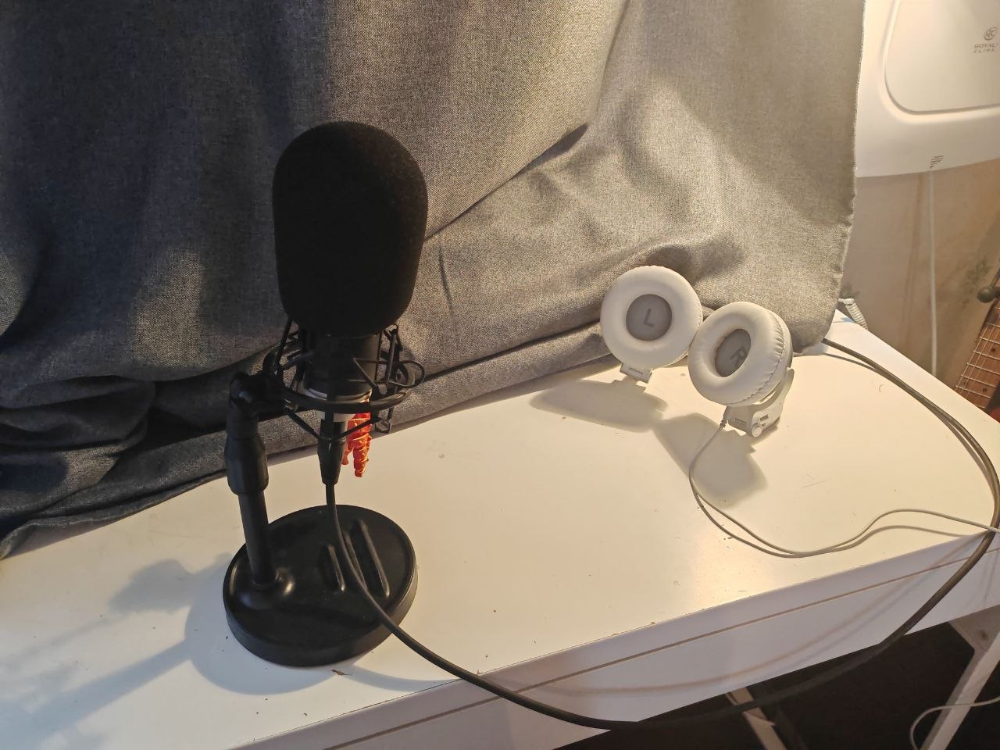 Наушники перед B-1 (Э4) | 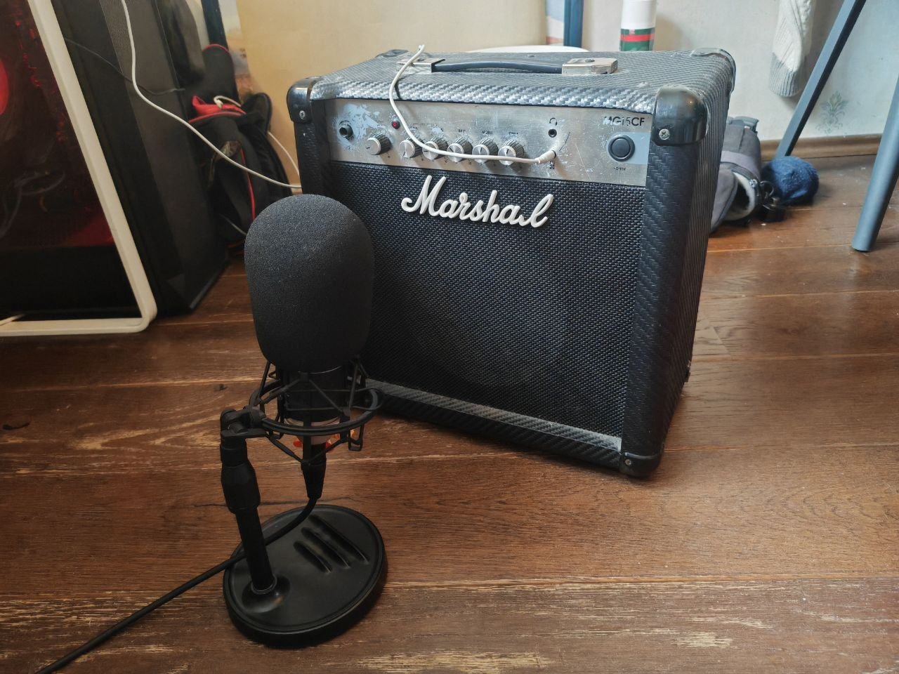 Marshall MG15CF и B-1 вблизи (Э8) |
| 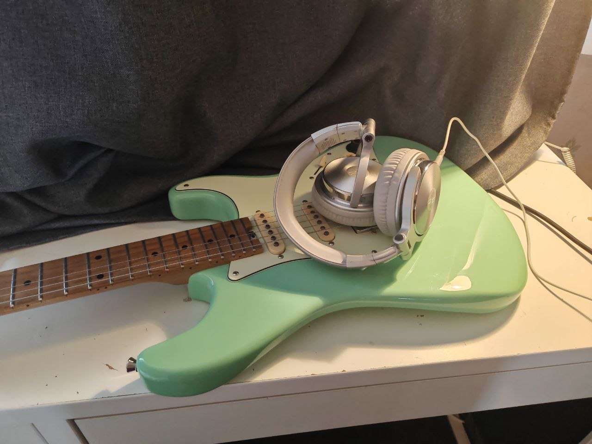 Наушник на звукоснимателях гитары (Э9–Э12) | 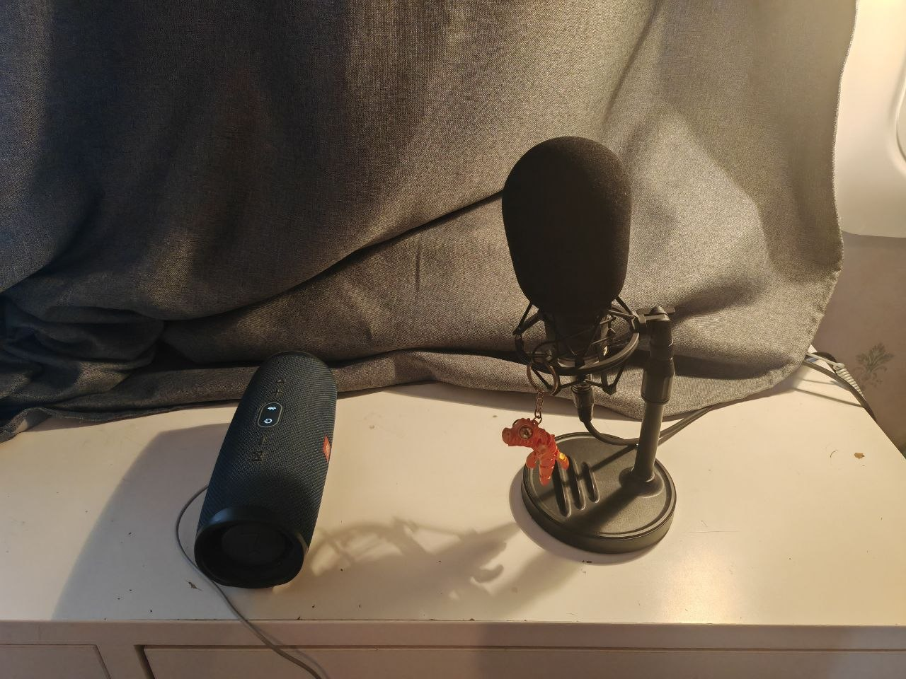 JBL и B-1, ~20 см (Э13) |
| 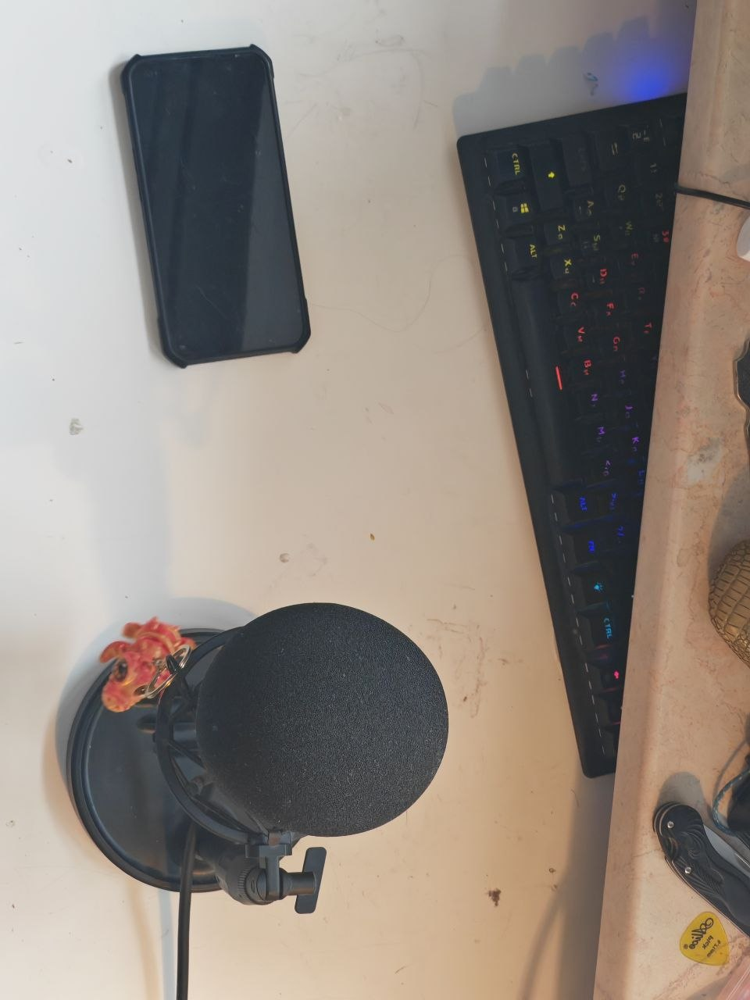 Телефон и B-1 (Э14) | |

---

## Э1. Симулятор модуляций в AWGN-канале — 2026-09-24

**Цель:** проверить, что симулятор правильный, сравнив его с теоретическими кривыми BER.

**Метод:** BPSK, QPSK, некогерентная FSK, OFDM (1024 поднесущих, префикс 256), по 2 млн бит на точку, Eb/N0 от 0 до 9 дБ.


**Результат:** все точки легли на теорию. BPSK, QPSK и OFDM совпадают, FSK отстаёт примерно на 4 дБ (цена некогерентного приёма). Симулятор годится как эталон.

---

## Э2. Замер свипом, попытка 1 — неудачная

**Условия:** громкость системы 27%, фоновые звуки в комнате, метод «спектр свипа против спектра тишины».

**Результат:** граница «8.3 кГц» — **ложная**. Свип был едва громче фона (+5…10 дБ), а фон менялся со временем (речь, щелчки), поэтому оценка шума по первым 2 секундам не работает.

**Вывод:** нужны громкость, тишина и метод, устойчивый к меняющемуся шуму. График не сохранился, его перезаписала следующая попытка.

---

## Э3. Замер свипом, попытка 2 — перегруз

**Условия:** громкость 100%, наушник у микрофона, фильтр B-1 переключён в flat.

**Результат:** граница «96 кГц» — **ложная**. Пик записи 1.00 означает клиппинг на 2–5 кГц (там резонанс наушников), на спектрограмме видны гармоники 2×, 3× и алиасинг выше 96 кГц. Зато основная линия свипа была видна до 86 кГц: это первый признак, что ультразвук проходит.

**Вывод:** убавить гейн на MiniFuse; перейти на деконволюцию, которая отделяет гармоники от линейного отклика.

---

## Э4. Замер свипом с деконволюцией — канал «наушники»

**Метод:** экспоненциальный свип 20 Гц – 86 кГц, 8 с, −6 дБFS. Импульсная характеристика (ИХ) = запись, поделённая на спектр свипа (с регуляризацией). Для АЧХ берётся окно ИХ от −5 до +50 мс; для оценки шума — такое же окно на 0.5 с позже. Пик записи 0.35, перегруза нет.


**Результат:**
- **1–15 кГц** — основная полоса, резонансный горб на 2–8 кГц.
- **18–22 кГц** — на 35–45 дБ ниже пика, но с большим запасом над шумом.
- **30–86 кГц** — около −65 дБ, запас над шумом 20–30 дБ. **Ультразвук проходит**, граница совпадает с концом свипа (86 кГц), реальный потолок может быть выше.
- **ИХ:** прямой звук, затем хвост отражений ~200 мс (затухание от −20 до −55 дБ). Среднеквадратичный разброс задержек ~16 мс. Это многолучёвость комнаты — аналог подводного канала.
- Гармоники искажений видны на −660 мс (2-я) и −1330 мс (4-я), точно по теории для экспоненциального свипа. В АЧХ они не попали.

**Ограничения:** ниже ~300 Гц АЧХ размыта сглаживанием по 600 Гц. Ровные «купола» на −55…−65 дБ в ИХ — фоновый шум комнаты, размазанный деконволюцией (уточнено в Э6: их уровень растёт, когда сигнал тише).

ИХ сохранена в `channels/наушники.npy` (250 мс, 192 кГц) и используется в симуляции.

---

## Э5. Модуляции на реальном канале комнаты

**Метод:** ИХ из Э4 переносится в комплексную baseband-форму на несущих 5 кГц и 20 кГц (полоса 4 кГц, энергия нормирована на 1). Классические приёмники:
- **QPSK** — компенсирует только фазу прямого луча, без эквалайзера;
- **OFDM** — 1024 поднесущих, префикс 256 (64 мс), эквалайзер по одному коэффициенту на поднесущую при известном канале.


**Результат:**

| | QPSK | OFDM |
|---|---|---|
| 5 кГц | пол ошибок ≈ 0.14 | ≈ 2·10⁻³ при 30 дБ |
| 20 кГц | пол ≈ 0.35 | ≈ 6·10⁻⁴ при 30 дБ |

**Почему так:**
- У QPSK отражения несут энергию, сравнимую с прямым лучом (−0.8 дБ на 5 кГц) или даже больше неё (+8.5 дБ на 20 кГц). Межсимвольная интерференция делает связь без эквалайзера невозможной.
- OFDM снимает всё, что укладывается в префикс, но энергия хвоста после 64 мс составляет −18 дБ. Это даёт пол ошибок около 10⁻³, и OFDM далеко отстаёт от кривой AWGN.
- Правильность проверена в `test_simulator.py`: на синтетическом канале OFDM совпадает с теорией частотно-избирательного канала (0.0400 против 0.0401).

**Оговорка:** канал нормирован по энергии, поэтому графики сравнивают только форму многолучёвости при равном SNR. Разницу в громкости между полосами (например, 20 кГц на 30–40 дБ тише пика) они не учитывают.

**Вывод для работы:** между кривыми AWGN и реального канала лежит разрыв в десятки дБ. Именно на этом участке нейросетевой приёмник должен показать, может ли он переиграть классику: убрать пол ошибок QPSK и хвост после префикса у OFDM.

---

## Э6. Колонки телевизора LG UltraWide (HDMI), метка «монитор»

**Условия:** выход по умолчанию — HDMI-выход видеокарты на монитор, громкость системы 65%, B-1 у колонок монитора. Пик записи 0.08 (тише, чем у наушников, на ~13 дБ); во время замера был фоновый шум (1–5 с на спектрограмме).

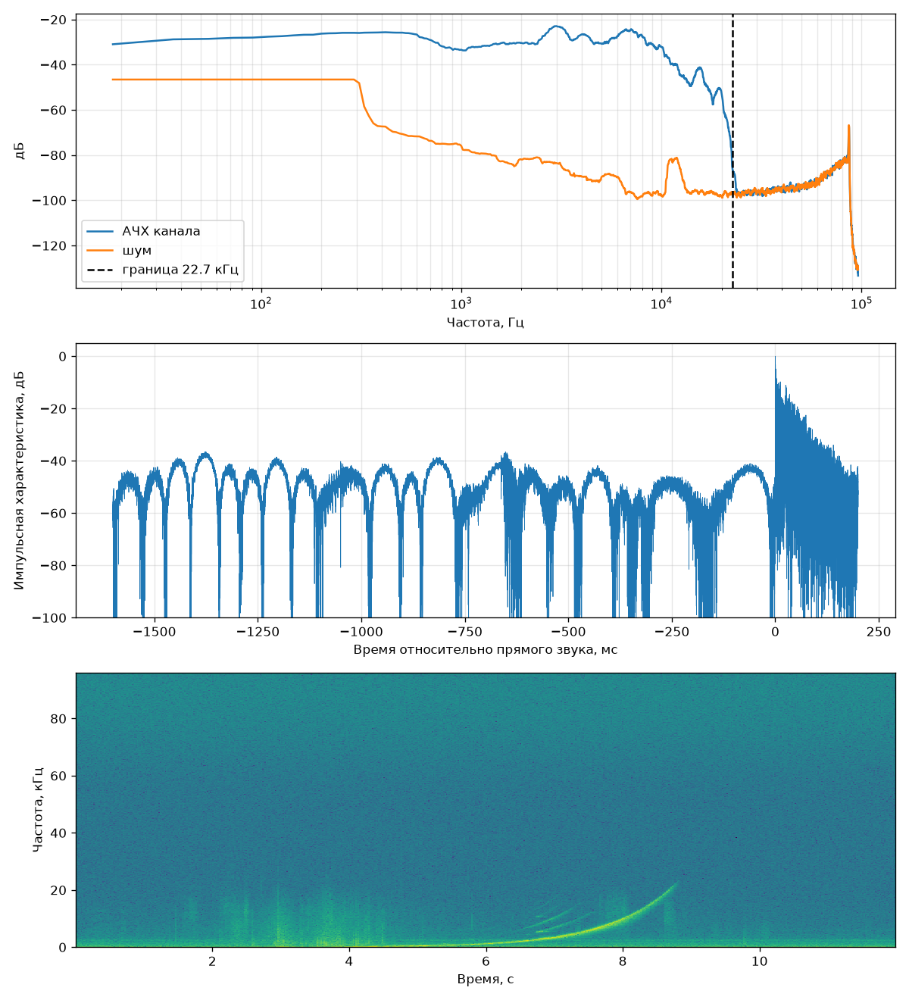

**Результат:**
- **Граница 22.7 кГц.** Монитор по HDMI принимает только 32/44.1/48 кГц (данные ELD), поэтому выше ~23 кГц звука нет в принципе: срез резкий, это фильтр ресемплера, а не динамик. **Ультразвук через монитор невозможен.**
- **600 Гц – 10 кГц** — ровнее, чем у наушников (разброс ~10 дБ, без выраженного горба). Выше 10 кГц спад на 20–30 дБ к 20 кГц.
- На 11 кГц в шуме есть тональная помеха (вероятно, электроника монитора).
- **ИХ:** хвост отражений ~200 мс, как у наушников (комната та же).
- «Купола» в ИХ здесь на −40 дБ, а у наушников на −55…−65 дБ. Сигнал на ~13 дБ тише, а купола на ~15–20 дБ выше: значит, это шум комнаты после деконволюции, а не артефакт метода. Оценка шума в `sweep.py` берётся из этой же области, поэтому она корректна.

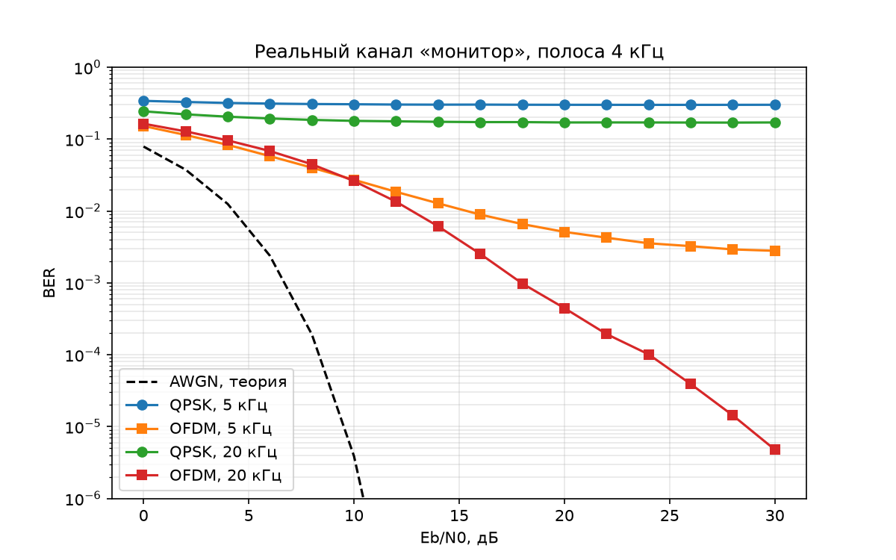

| | эхо / прямой луч | энергия после префикса | разброс задержек (rms) | QPSK | OFDM при 30 дБ |
|---|---|---|---|---|---|
| наушники, 5 кГц | −0.8 дБ | −17.7 дБ | 16.8 мс | пол 0.14 | 2·10⁻³ |
| наушники, 20 кГц | +8.5 дБ | −18.6 дБ | 15.9 мс | пол 0.35 | 6·10⁻⁴ |
| монитор, 5 кГц | +5.5 дБ | −14.8 дБ | 20.2 мс | пол 0.30 | 3·10⁻³ |
| монитор, 20 кГц | 0.0 дБ | **−29.7 дБ** | **7.6 мс** | пол 0.17 | **7·10⁻⁶** |

**Вывод:** на 20 кГц у монитора хвост отражений заметно короче (высокие частоты сильнее поглощаются комнатой, а колонки направленнее), поэтому OFDM выходит почти без пола ошибок. Но по «Оговорке» из Э5 20 кГц у монитора на ~30 дБ тише основной полосы, так что реальный SNR там будет намного ниже. QPSK без эквалайзера не работает ни на одном канале.

---

## Э7. Гитарный усилитель Marshall MG15CF

**Условия:** усилитель подключён к выходу MiniFuse, B-1 перед динамиком.

**Попытка 1 — перегруз:** громкость системы 49%, пик записи 1.00. Клиппинг длился ~80 мс на 3.85–3.93 с, это ~150 Гц — резонанс гитарного динамика, самая громкая его частота. На спектрограмме видна широкополосная вертикальная линия. Результат отброшен.

**Попытка 2:** громкость системы на время замера снижена до 28% (≈ −7 дБ), пик записи 0.27.

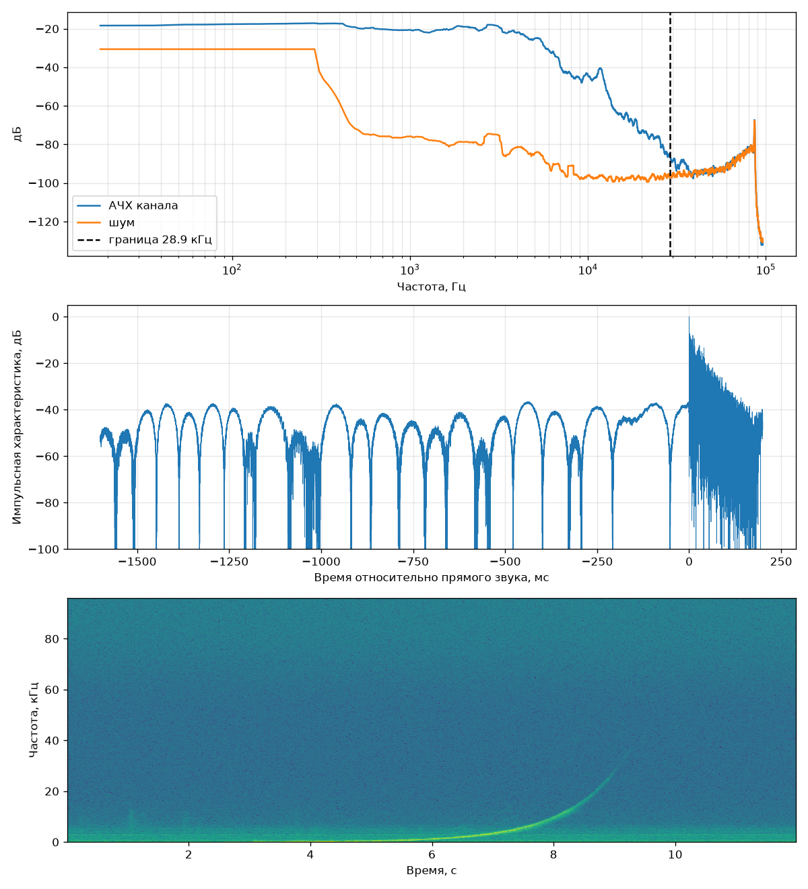

**Результат:**
- **20 Гц – 3.5 кГц — самая ровная АЧХ из всех замеров** (разброс ±2 дБ).
- **Выше 4 кГц крутой спад:** −20 дБ к 8 кГц, −45 дБ к 15 кГц, −60 дБ к 25 кГц. Граница 28.9 кГц, но выше 15 кГц сигнал очень слабый. Предположение «гитарный динамик режет выше ~5 кГц» подтвердилось.
- **Нелинейность** на умеренной громкости почти не видна: гармоник на спектрограмме меньше, чем у наушников. Гармоники в попытке 1 дал клиппинг АЦП, а не сам усилитель. Предположение «самый грязный канал» на этой громкости **не подтвердилось**; проверить на громкости с перегрузом самого усилителя.
- Шум на низких частотах выше, чем в других замерах (−30 дБ против −40…−46): фон и шипение усилителя.
- **ИХ:** хвост ~200 мс, как в других замерах.

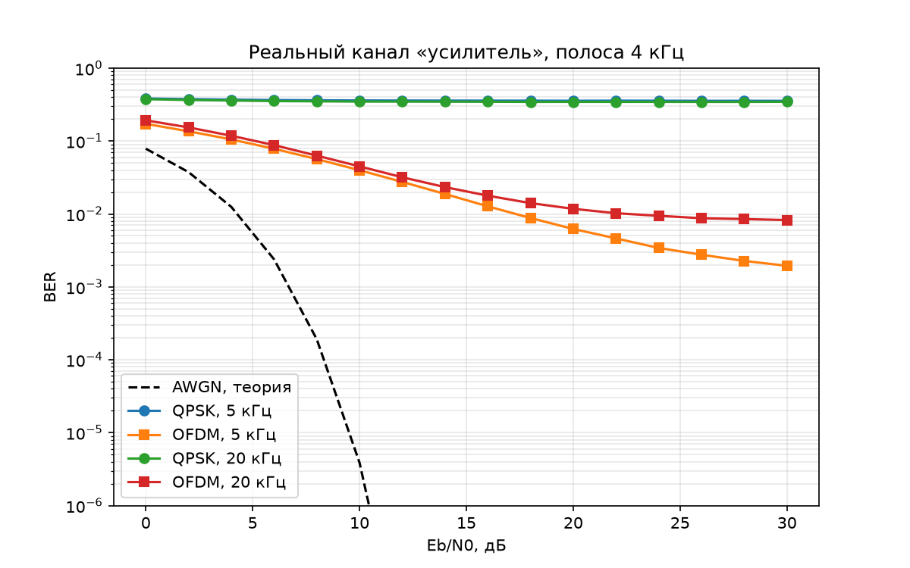

**Сводная таблица каналов** (энергия канала нормирована, см. оговорку в Э5):

| канал | эхо / прямой луч | энергия после префикса | разброс задержек (rms) | QPSK | OFDM при 30 дБ |
|---|---|---|---|---|---|
| наушники, 5 кГц | −0.8 дБ | −17.7 дБ | 16.8 мс | пол 0.14 | 2·10⁻³ |
| наушники, 20 кГц | +8.5 дБ | −18.6 дБ | 15.9 мс | пол 0.35 | 6·10⁻⁴ |
| монитор, 5 кГц | +5.5 дБ | −14.8 дБ | 20.2 мс | пол 0.30 | 3·10⁻³ |
| монитор, 20 кГц | 0.0 дБ | −29.7 дБ | 7.6 мс | пол 0.17 | 7·10⁻⁶ |
| усилитель, 5 кГц | +8.7 дБ | −13.8 дБ | 21.1 мс | пол 0.36 | 2·10⁻³ |
| усилитель, 20 кГц | +7.9 дБ | −18.3 дБ | 20.4 мс | пол 0.34 | **8·10⁻³** |

**Вывод:** на 20 кГц у усилителя худший OFDM из всех каналов, хотя энергия после префикса такая же, как у наушников. Причина — крутой наклон АЧХ внутри полосы 18–22 кГц (~15 дБ), из-за которого часть поднесущих оказывается очень слабой. На 5 кГц полоса 3–7 кГц попадает на начало спада. Для связи через гитарный усилитель лучше подходит полоса ниже 3.5 кГц.

---

## Изменения метода (после Э7)

- **Запись длиннее:** после свипа 5 с тишины вместо 2, чтобы не обрезать длинные хвосты ревербераторов. Шум для АЧХ берётся через 4 с после прямого звука (но не дальше, чем позволяет длина записи). Для симулятора сохраняется 1 с канала вместо 0.25 с. Каналы Э4–Э7 не пересчитывались, чтобы цифры выше остались прежними.
- **Пауза 1 с** после переключения PipeWire на 192 кГц: без неё один раз воспроизведение стартовало на ~10 с позже записи.
- **Метрики** (`метрики()` в `sweep.py`, все в полосе до 4 кГц, чтобы гитарные каналы были сравнимы с остальными):
  - **гармоники** — энергия импульсной характеристики k-й гармоники в окне ±5 мс относительно основной. Энергия, а не пик: у нашего свипа гармоники приходят с фазовым сдвигом, и пик занижает их на ~2 дБ. Уровень шума — средняя мощность ИХ после хвоста; гармоника ниже шума + 6 дБ помечается «шум»;
  - **RT60** — по кривой Шрёдера (участок −5…−25 дБ), хвост обрезается там, где тонет в шуме;
  - **энергия после 64 мс** (длина префикса OFDM) — доля энергии хвоста, которая станет помехой для OFDM.
- Проверка в `test_sweep.py` на синтетическом канале: RT60 = 0.5 с и 3-я гармоника −32.6 дБ находятся верно.
- Каналы с длинными старыми записями по 12 с (наушники, монитор, усилитель) дают менее надёжные гармоники: в ИХ много «куполов» шума.

---

## Э8. Гитарный усилитель вблизи: вход AUX и гитарный вход

**Условия:** B-1 в 5–10 см от сетки динамика, pad −10 дБ, громкость системы 28% во всех замерах.

- **g0, попытка 1:** пик 0.01 — ручка гейна на MiniFuse случайно стояла на нуле. Отброшено.
- **g0, попытка 2:** пик 0.71. Вблизи эха почти нет: ИХ падает до −40 дБ за ~20 мс, энергия после 64 мс −34 дБ (с 50 см было −18 дБ).
- **g3:** АЧХ совпала с g0 до долей дБ, пик тот же 0.71, 3-я гармоника почти не изменилась, а **шум вырос на 16 дБ**. Вывод: сигнал шёл через вход **AUX, который обходит предусилитель** — ручка Gain меняла только собственный шум усилителя.
- **Гитарный вход, Gain на минимуме:** замер пустой (пик 0.02, только фон) — на этом входе минимальный Gain означает тишину. Серию перегруза на усилителе заменили гитарным процессором (Э9–Э10).

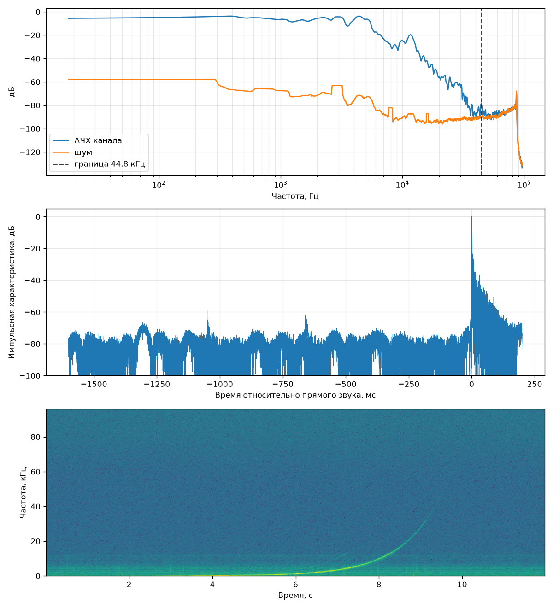

---

## Э9. Гитара Mooer GTRS S801: установка и наводка

**Цепочка:** выход MiniFuse → наушник, лежащий на звукоснимателе (магнитная связь: переменное поле катушки наушника наводит сигнал в звукоснимателе) → встроенный процессор GTRS → радиопередатчик → приёмник → вход 2 MiniFuse. Струны заглушены. Громкость системы 60% (при 100% был перегруз на 0.9–2.2 кГц — резонанс звукоснимателя).

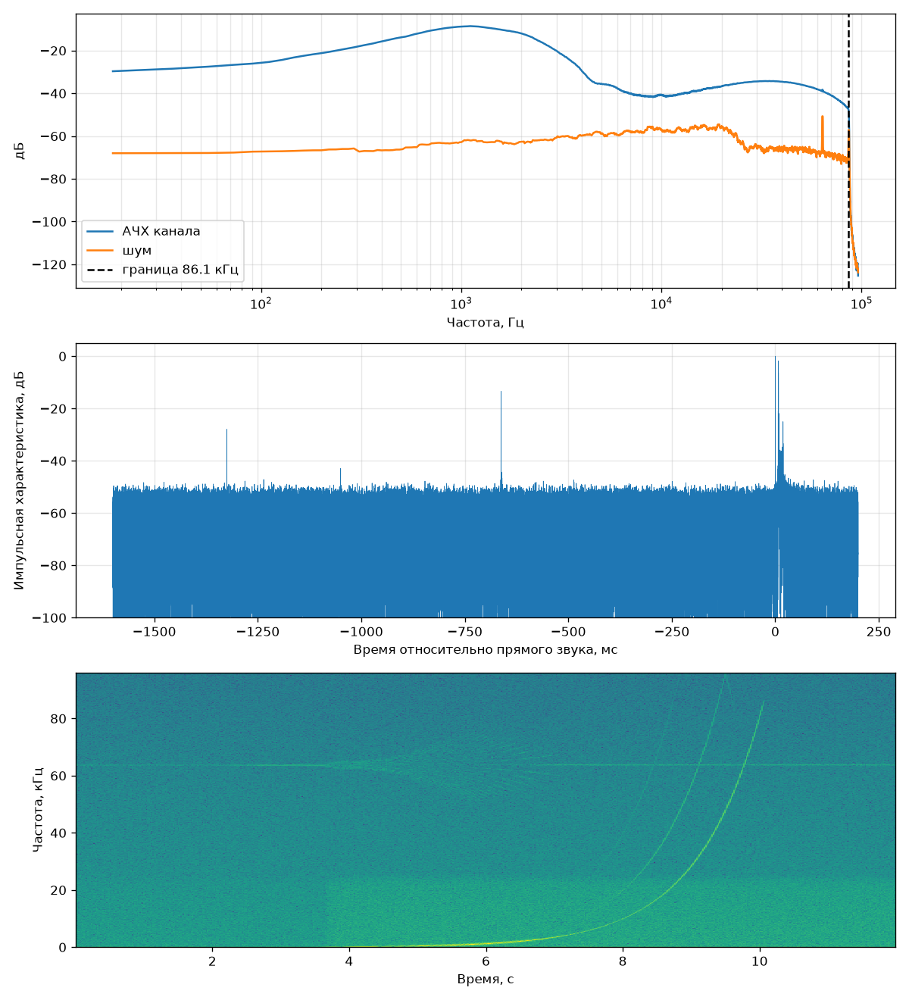

- **АЧХ:** горб на ~1 кГц и спад после 3 кГц — классический резонанс звукоснимателя. Эха нет совсем (связь магнитная, комната не участвует).
- **Неожиданно: свип до 86 кГц и 2-я гармоника −13 дБ.** Радиосистема цифровая (48 кГц), выше 24 кГц через неё ничего пройти не может.
- **Проверка — громкость гитары на нуле:** горб на 1 кГц исчез, а свип выше ~3 кГц остался, растёт на ~6 дБ на октаву (типично для наводки) до −35 дБ на 35 кГц. Сильная 2-я гармоника осталась вместе с ним.

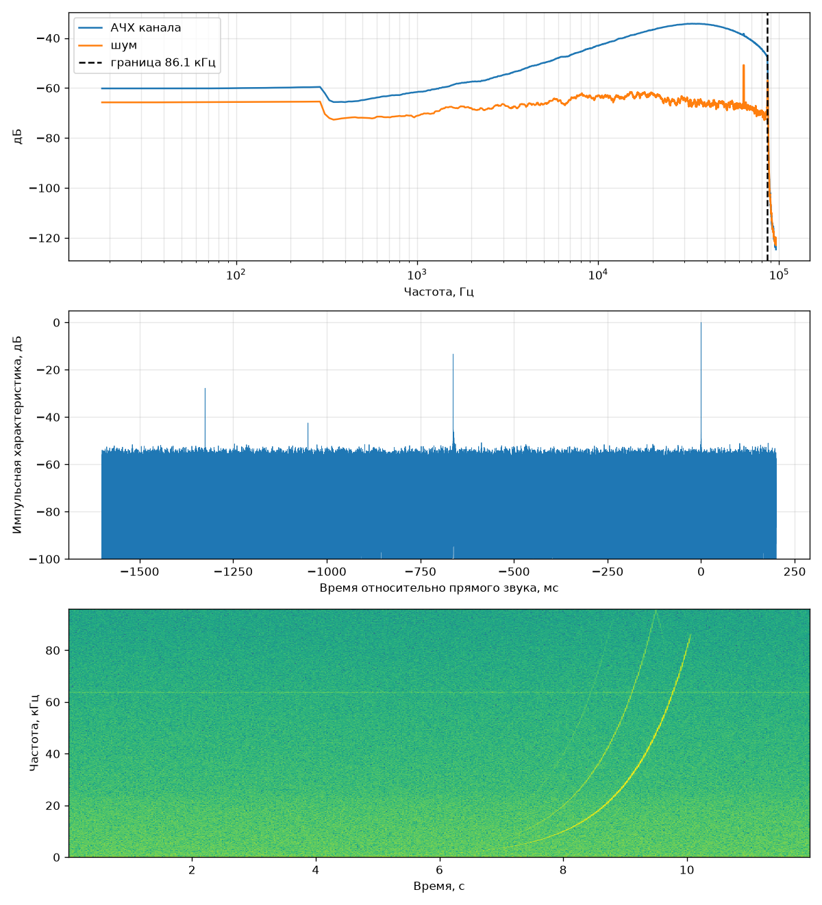

- **Разведение проводов ничего не изменило** (совпадение до 0.1 дБ) → наводка электрическая, внутри MiniFuse (выход наушников → вход 2) или через приёмник, воткнутый рядом с гнездом наушников.
- **Итог:** ниже ~4 кГц сигнал идёт через звукосниматель и процессор и на 30–50 дБ сильнее наводки; выше ~5 кГц — наводка. Поэтому все метрики считаются в полосе до 4 кГц.
- **Особенности установки:** передатчик засыпает через несколько минут без сигнала (один замер пустой); приёмник глушит выход без сигнала — на спектрограмме это шумовой «прямоугольник» до 24 кГц с резкими краями.

---

## Э10. Нелинейность: Tube Screamer против RAT

**Настройки GTRS:**
- **Tube Screamer:** Gain 3 (минимум) / 33 / 66 / 100, Volume 100, Tone 43.
- **RAT:** Distortion 6 (минимум) / 33 / 66 / 100, Filter 50, Volume 100 (сначала 50 — было слишком тихо, повторено).

Первый замер TS 33 упёрся в 1.00, и 3-я гармоника показала «−18.6 дБ» — почти целиком это был перегруз АЦП. После снижения гейна входа 2 на MiniFuse — −44.9 дБ. **Перегруз АЦП даёт такие же нечётные гармоники, как педаль, поэтому пик записи проверялся после каждого замера.**

**Гипотеза:** обе педали ограничивают сигнал симметрично → только нечётные гармоники. TS ограничивает мягко (как `tanh`), RAT — жёстко (почти срезает пики) → у RAT должны быть намного сильнее высокие гармоники (5-я, 7-я).

| | 2-я | 3-я | 5-я | 7-я |
|---|---|---|---|---|
| TS 3 | шум | шум (−48) | шум | шум |
| TS 33 | шум | −44.9 | −51.4 | шум |
| TS 66 | шум | −29.8 | шум | шум |
| TS 100 | шум | **−14.5** | −41.3 | шум |
| RAT 6 | шум | −41.7 | шум | шум |
| RAT 33 | шум | −35.7 | −48.4 | шум |
| RAT 66 | шум | −17.2 | −38.6 | −49.1 |
| RAT 100 | шум | **−13.7** | **−26.9** | **−44.0** |

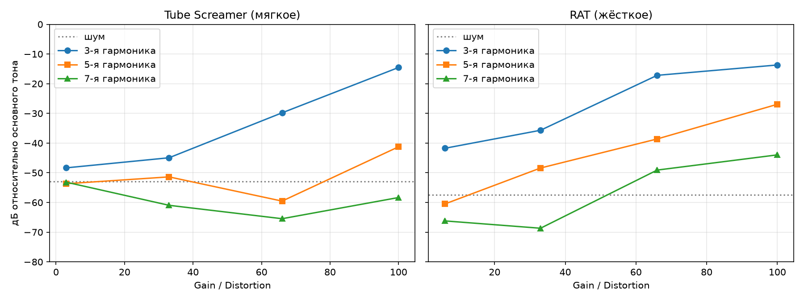

**Результат — гипотеза подтвердилась:**
- чётных гармоник нет ни в одном замере — ограничение симметричное;
- на максимуме 3-я гармоника у педалей почти одинаковая (−14.5 и −13.7 дБ), а **5-я у RAT на ~14 дБ выше, 7-я поднимается над шумом только у RAT**;
- рост нелинейный: от минимума до ~33 почти ничего, затем резкий рост — типичная кривая ограничения;
- RAT всё же не идеальный «прямоугольник» (у него 5-я была бы −14 дБ, 7-я −17 дБ): кремниевые диоды срезают не мгновенно, а фильтр RAT глушит верх.

| TS 100 | RAT 100 |
|---|---|
| 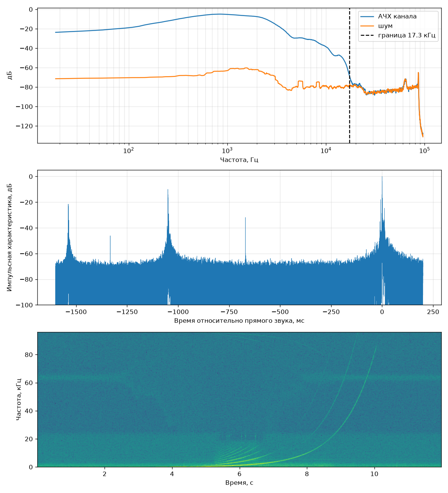 | 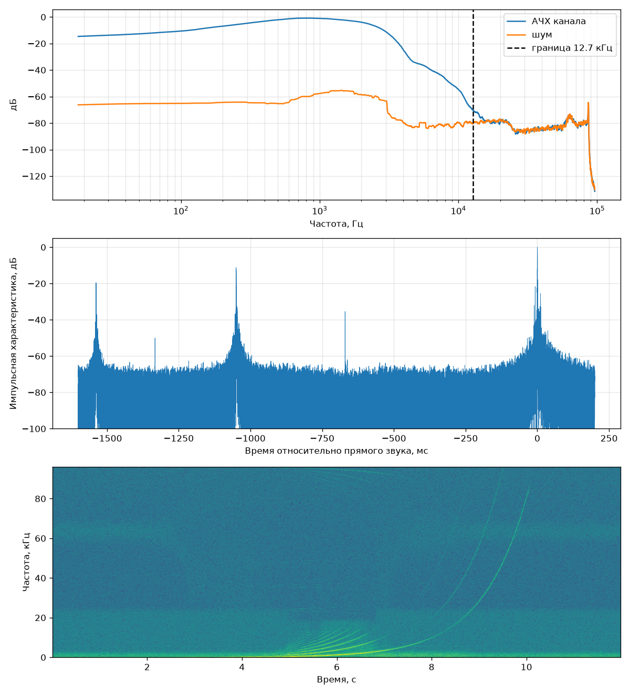 |

**Для работы:** есть ряд реальных каналов с управляемой нелинейностью от ~0.4% до ~20%. Модель Раппа с параметром плавности, подобранным по этой таблице, — следующий шаг для симулятора.

---

## Э11. Ревербераторы GTRS

| | Decay | Pre-delay | Mix | RT60 | энергия после 64 мс |
|---|---|---|---|---|---|
| без эффектов | — | — | — | 0.12 с | −55 дБ |
| Room | 35 | 0 | 50 | **1.08 с** | −15.4 дБ |
| Hall | 53 | 25 | 50 | **2.56 с** | −11.0 дБ |
| Spring | 25 | 0 | **60** | **1.64 с** | **−7.4 дБ** |

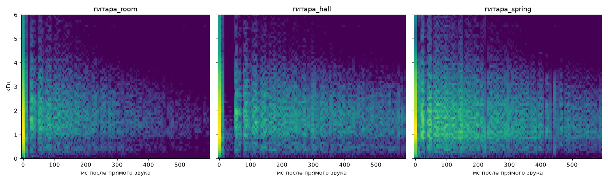

- **Room:** плотный хвост, высокие частоты гаснут первыми — как в настоящей комнате.
- **Hall:** видна пауза ~10–50 мс после прямого звука (Pre-delay 25), затем долгий ровный хвост.
- **Spring:** самый энергичный хвост (отчасти из-за Mix 60), повторяющиеся вертикальные полосы на ~230, 300, 440 мс — отражения от концов «пружины». **Дисперсии (наклонных «чирпов») не видно**: цифровая модель пружины упрощена, проверить на ней дисперсию подводного канала нельзя.

| Room | Hall | Spring |
|---|---|---|
| 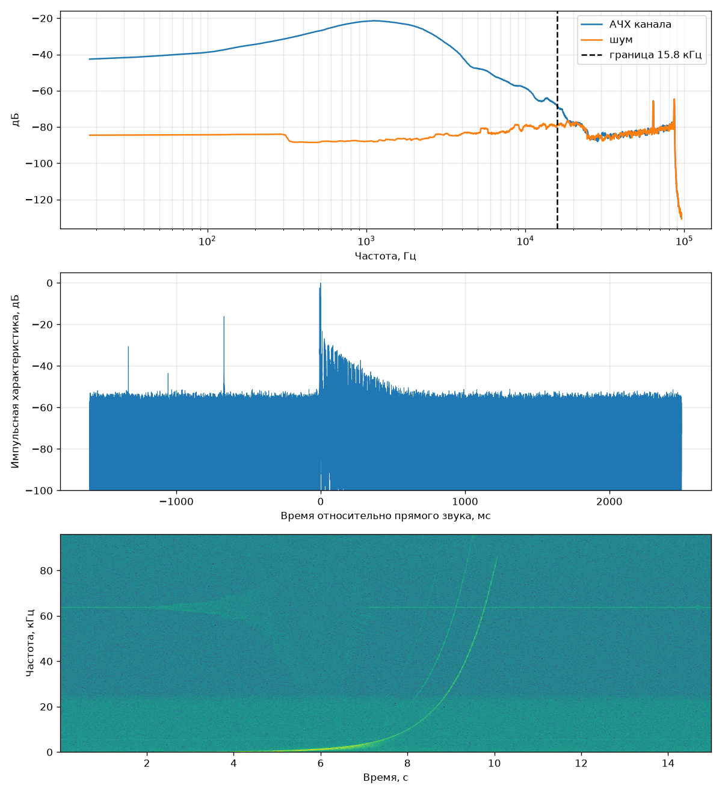 | 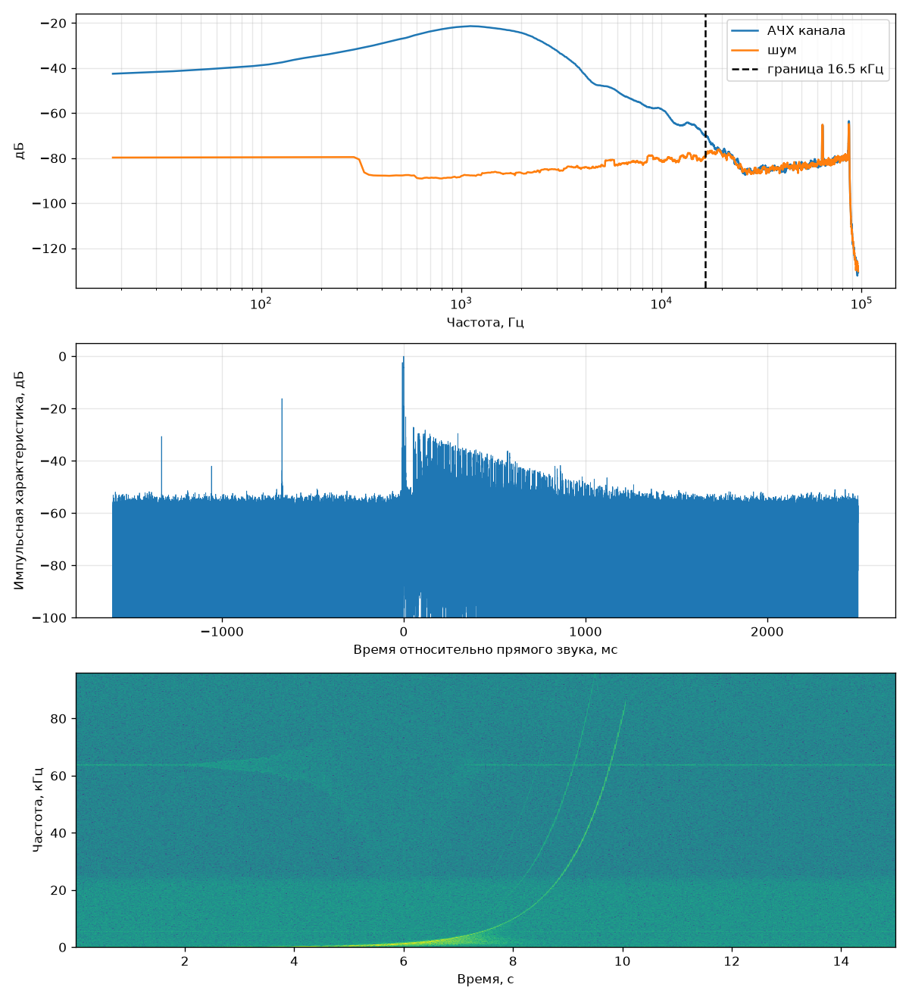 | 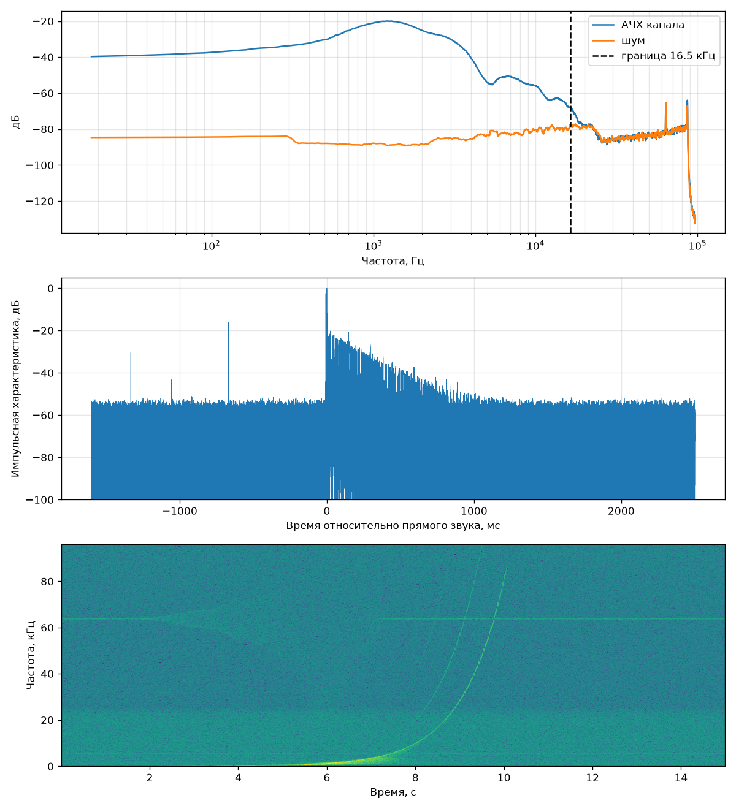 |

---

## Э12. Delay GTRS

Digital Delay, Feedback 30, Mix 50.

| экран Time | 1-й повтор | 2-й | 3-й | 4-й |
|---|---|---|---|---|
| 40 | **40.1 мс**, −4.5 дБ | 80.1 мс, −15.0 дБ | 120.1 мс, −25.5 дБ | 160.1 мс, −36.0 дБ |
| 300 | **260.1 мс**, −4.5 дБ | 520.1 мс, −15.0 дБ | 780.1 мс, −25.5 дБ | 1040.1 мс, −36.0 дБ |

- Каждый повтор тише предыдущего на 10.5 дБ = Feedback 30% (20·lg 0.3). Первый повтор −4.5 дБ соответствует Mix 50.
- **При Time 300 реальная задержка 260 мс** (на 13% меньше), при Time 40 — точная. Параметры канала нужно измерять, а не брать с экрана.
- Слабый пик на 11.3 мс (−23 дБ) и его копия на 51.3 мс — отражение внутри цепочки до блока Delay.

| 40 мс | 300 (260) мс |
|---|---|
|  | 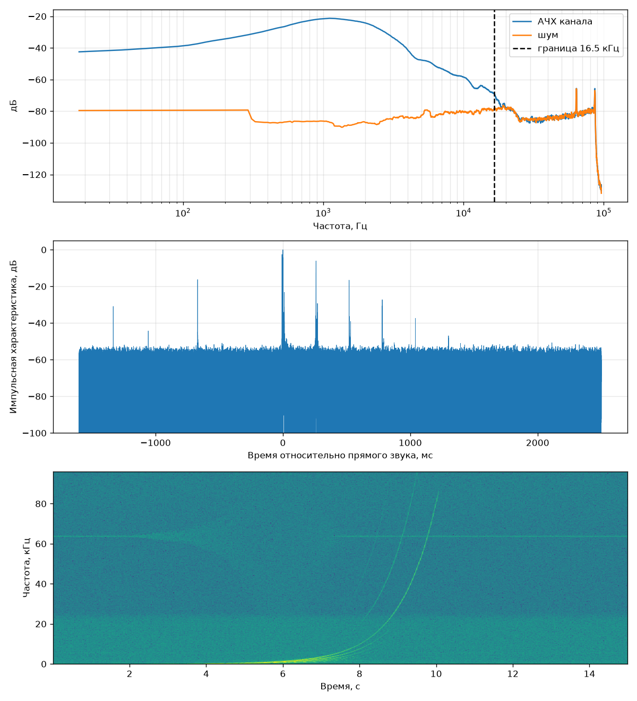 |

---

## Э13. JBL по проводу

B-1 в ~20 см перед колонкой, громкость системы 60%, пик 0.50.

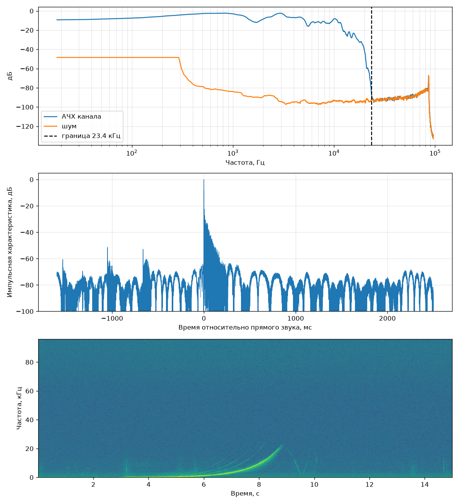

- **Самая ровная АЧХ из всех динамиков:** 20 Гц – 10 кГц ±5 дБ, **резкий срез на ~22 кГц**.
- **У JBL цифровая обработка даже на проводном входе:** срез резкий, как у цифрового фильтра, а после 9-й секунды гармоники, упёршись в ~24 кГц, отражаются вниз (V-образные линии на спектрограмме) — алиасинг внутри колонки.
- 2-я гармоника −46.3 дБ, 3-я −42.4 дБ (~0.8%). RT60 0.23 с, энергия после 64 мс −27 дБ — на 20 см прямой звук доминирует.

---

## Э14. Телефон (внешний режим)

Телефон в ~20 см перед микрофоном, громкость ~70%, играет `sweep_48k.wav` (48 кГц, 16 бит). Запись 60 с, свип найден на 5.06 с; расхождение часов телефона и MiniFuse на ИХ не заметно.

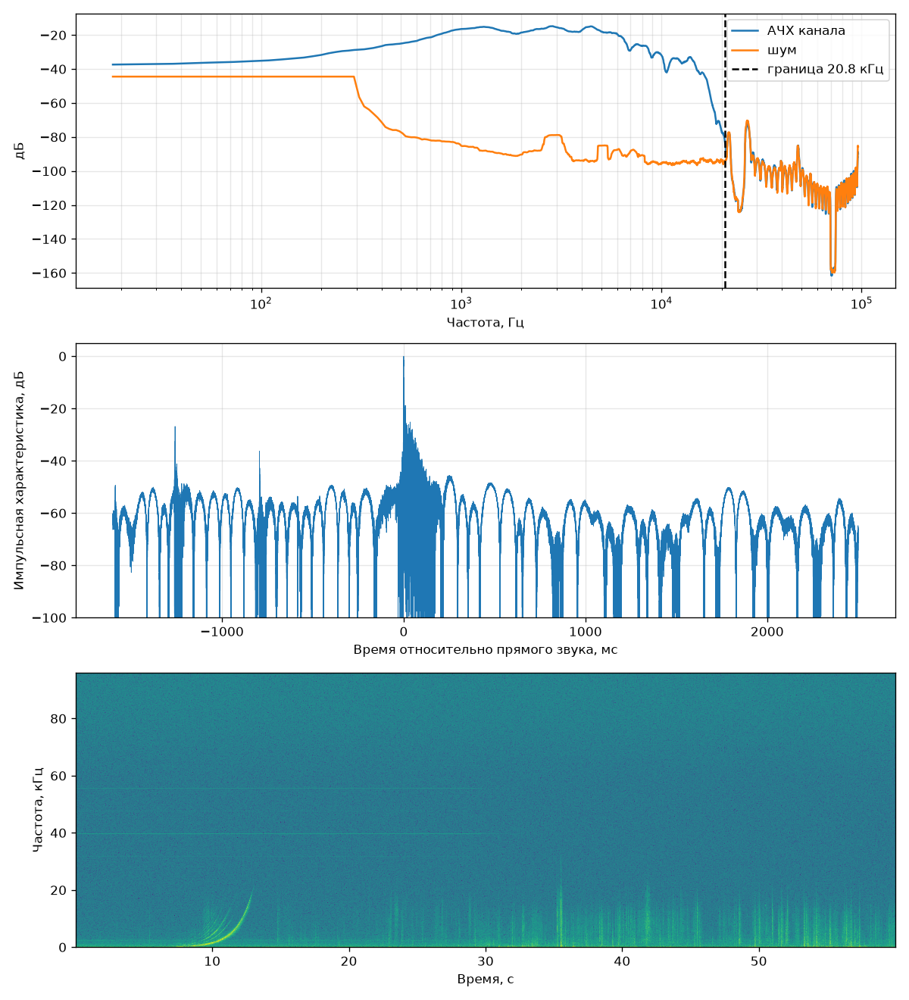

- Басов нет (ниже 300 Гц на 20+ дБ тише пика), максимум на 1–5 кГц, провал около 6–7 кГц, **срез на 20.8 кГц** (телефон сам работает на 48 кГц).
- **Самый нелинейный динамик:** 2-я гармоника −36.2 дБ, 3-я **−30.9 дБ (~3%)**. Для сравнения: JBL ~0.8%.
- RT60 0.31 с, энергия после 64 мс −20.5 дБ. Посторонние звуки после 15-й секунды на результат не повлияли.

---

## Э15. Сводка: метрики и симуляция всех каналов

**Метрики** (`report.py`, полоса до 4 кГц):

| канал | граница, кГц | пик | шум гармоник | 2-я | 3-я | 5-я | 7-я | RT60, с | после 64 мс, дБ |
|---|---|---|---|---|---|---|---|---|---|
| наушники | 86.0 | 0.35 | −45.1 | −33.4 | шум | −34.9 | −39.1 | 0.30 | −16.5 |
| монитор (ТВ) | 22.6 | 0.08 | −26.7 | −20.4 | шум | шум | шум | 0.23 | −15.3 |
| усилитель, 50 см | 29.1 | 0.27 | −25.0 | шум | шум | шум | шум | 0.19 | −17.7 |
| усилитель вблизи, g0 | 45.3 | 0.71 | −52.7 | шум | шум | шум | шум | 0.12 | −33.9 |
| усилитель вблизи, g3 | 45.0 | 0.71 | −52.2 | шум | −45.2 | −38.5 | −36.3 | 0.12 | −34.6 |
| гитара без эффектов | 86.1 | 0.22 | −55.3 | шум | шум | шум | шум | 0.12 | −54.7 |
| TS 3 / 33 / 66 / 100 | — | — | — | см. Э10 | | | | 0.09–0.11 | −38…−44 |
| RAT 6 / 33 / 66 / 100 | — | — | — | см. Э10 | | | | 0.07–0.09 | −38…−45 |
| Room | 15.8 | 0.06 | −66.0 | шум | шум | шум | −58.5 | 1.08 | −15.4 |
| Hall | 16.5 | 0.06 | −64.8 | шум | шум | шум | шум | 2.56 | −11.0 |
| Spring | 16.5 | 0.10 | −63.6 | шум | шум | шум | шум | 1.64 | −7.4 |
| Delay 40 | 16.0 | 0.07 | −66.1 | шум | шум | шум | шум | — | −16.0 |
| Delay 300 (260) | 16.5 | 0.07 | −64.6 | шум | шум | шум | шум | — | −5.8 |
| JBL | 23.4 | 0.50 | −60.4 | −46.3 | −42.4 | −51.2 | шум | 0.23 | −27.0 |
| телефон | 20.8 | 0.24 | −44.3 | −36.2 | −30.9 | шум | шум | 0.31 | −20.5 |

Гармоники наушников, монитора и усилителя 50 см ненадёжны (короткие старые записи, «купола» шума): у наушников «5-я и 7-я» на уровне 2-й — скорее всего шум, а не искажения.

**Симуляция** (`simulator.py`, полоса 4 кГц, канал нормирован; гитарные каналы на несущей 2 кГц, остальные на 5 и 20 кГц):

| канал | несущая, кГц | энергия после префикса, дБ | разброс задержек, мс | QPSK при 30 дБ | OFDM при 30 дБ |
|---|---|---|---|---|---|
| гитара без эффектов | 2 | −39.3 | 2.0 | 0.021 | 0 |
| TS / RAT (все) | 2 | −38…−43 | 1.3–2.1 | 0.16–0.25 | 0 |
| Room | 2 | −16.9 | 24.3 | 0.16 | 1.1·10⁻⁵ |
| Hall | 2 | −12.4 | 69.6 | 0.18 | **1.1·10⁻³** |
| Spring | 2 | −8.5 | 76.9 | 0.21 | **2.6·10⁻³** |
| Delay 40 | 2 | −17.1 | 19.4 | 0.20 | 0 |
| Delay 300 (260) | 2 | −6.6 | 123.8 | 0.20 | **1.5·10⁻²** |
| JBL | 5 / 20 | −28.0 / −31.2 | 5.6 / 7.5 | 0.039 / 0.030 | 4·10⁻⁶ / 0 |
| телефон | 5 / 20 | −24.1 / −3.2 | 8.2 / 316 | 0.013 / 0.31 | 0 / 9·10⁻² |
| усилитель вблизи g0 | 5 / 20 | −38.0 / −33.1 | 1.9 / 3.9 | 0.14 / 0.18 | 0 / 1.9·10⁻⁵ |

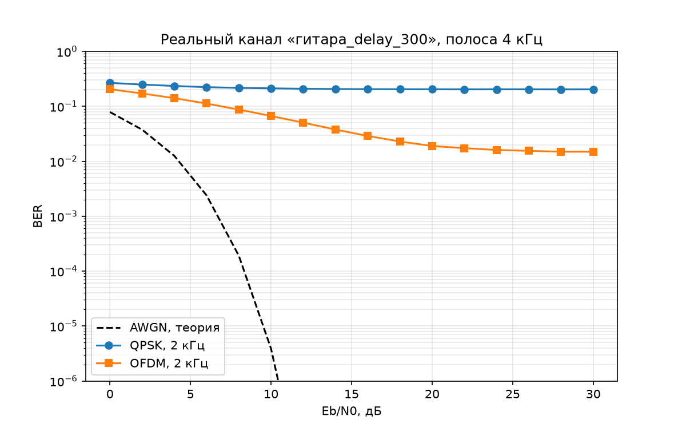

**Выводы:**
- **OFDM ломается ровно там, где энергия приходит позже префикса:** Delay 260 мс (−6.6 дБ за префиксом) — 1.5% ошибок, Spring и Hall — 0.1–0.3%. Delay 40 мс проходит без ошибок: второй повтор выходит за префикс, но на −17 дБ он слишком слаб.
- **QPSK без эквалайзера не работает ни на одном канале**, даже на коротких гитарных (разброс задержек 1–2 мс = 4–8 символов на 4 кГц).
- **Телефон на 20 кГц непригоден:** срез на 20.8 кГц оставляет половину полосы 18–22 кГц пустой.
- **TS и RAT в симуляции неотличимы от чистого канала** — симулятор пока использует только линейную часть канала (ИХ). Нелинейность (Э10) нужно добавить отдельно.

---

## Э16. Модель нелинейности: Рапп по гармоникам TS и RAT

**Модель Раппа:** `y = x / (1 + |x/A|^(2p))^(1/(2p))`. Здесь A — уровень насыщения, p — плавность изгиба (малое p — мягкое ограничение, большое — почти жёсткий срез).

**Подбор:** синус амплитуды 1 проходит через модель, (A, p) подбираются по измеренным 3-й, 5-й и 7-й гармоникам из Э10 (у TS 100 7-я в шуме, поэтому она учитывается как ограничение сверху, < −55 дБ).

| | A | p | модель: 3-я / 5-я / 7-я | измерено | ошибка |
|---|---|---|---|---|---|
| RAT 100 | 0.491 | **3.61** | −13.3 / −27.0 / −44.0 | −13.7 / −26.9 / −44.0 | **0.2 дБ** |
| TS 100 | 0.739 | **1.53** | −18.9 / −39.7 / −54.5 | −14.5 / −41.3 / < −55 | 2.7 дБ |

- **Подбор только по 3-й и 5-й гармоникам неоднозначен.** Сначала для TS вышел «жёсткий» срез (p = 20), для RAT — мягкий. У жёсткого среза определённой глубины 5-я гармоника случайно почти обнуляется. Только 7-я гармоника убрала эту неоднозначность.
- **Физика сошлась: TS мягче (p = 1.5), чем RAT (p = 3.6).**
- RAT описывается почти идеально. У TS 3-я гармоника в модели на ~4 дБ ниже: модель без памяти не учитывает «горб» TS на средних частотах, из-за которого перегруз зависит от частоты. Модель `tanh` описывает обе педали хуже (TS — 3.7 дБ, RAT — 2.1 дБ).

**В симуляторе** (`исказить()`): комплексный сигнал переносится на несущую (передискретизация ×16 через БПФ, без потерь), реальный «звук» нормируется на уровень синуса амплитуды 1 (как при подборе), проходит через модель Раппа и переносится обратно; всё вне полосы отбрасывается. Проверки в `test_simulator.py`: без ограничения сигнал не меняется (ошибка ~10⁻¹²; единственная частота на краю полосы −2 кГц попадает в 0 Гц и даёт ошибку −49 дБ, на результаты это не влияет); модель RAT повторяет измеренные гармоники с точностью 1 дБ.

---

## Э17. Честная классика: MMSE-эквалайзер и OFDM с пилотами

**Приёмники** (полоса 4 кГц, несущая 2 кГц, 2¹⁹ бит на точку):
- **QPSK, без эквалайзера** — как раньше, для сравнения;
- **QPSK, MMSE** — линейный эквалайзер на 129 отводов (32 мс; 32 отвода «вперёд», 96 «назад»), обучается методом наименьших квадратов по 4096 известным символам в начале передачи;
- **OFDM, пилоты** — 4 известных OFDM-символа в начале; канал оценивается делением на пилоты, усреднением и очисткой во временной области (оставляются первые 256 отсчётов импульсной характеристики и 16 до неё);
- **OFDM, идеальный канал** — как раньше, знает линейную часть канала точно (нижняя граница для OFDM).

Энергия пилотов и обучающей последовательности (~1%) в Eb/N0 не учитывается. Проверка в `test_simulator.py` на коротком эхе: MMSE снимает эхо (BER < 10⁻³ при 12 дБ, без эквалайзера > 1%), OFDM с пилотами уступает идеальному не больше чем в 1.5 раза.

**Сценарии:** Spring без искажений; RAT 100 (модель Раппа + собственная короткая ИХ RAT); RAT 100 + Spring; TS 100 + Spring (искажение, затем ИХ Spring).

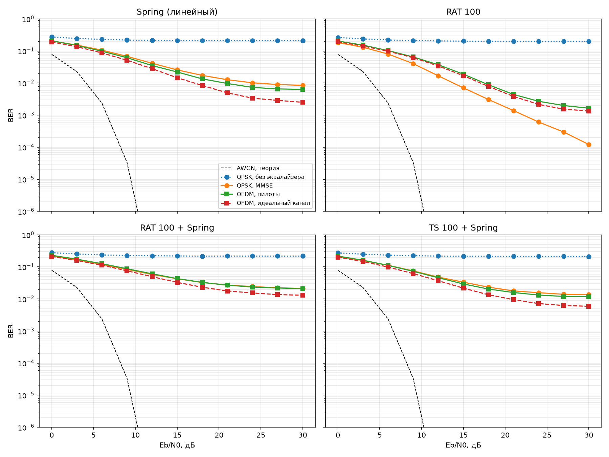

**BER при 30 дБ:**

| | QPSK без экв. | QPSK, MMSE | OFDM, пилоты | OFDM, идеальный |
|---|---|---|---|---|
| Spring | 0.2 | 9·10⁻³ | 6·10⁻³ | 3·10⁻³ |
| RAT 100 | 0.2 | **1·10⁻⁴** | 2·10⁻³ | 1·10⁻³ |
| RAT 100 + Spring | 0.2 | 2·10⁻² | 2·10⁻² | 1·10⁻² |
| TS 100 + Spring | 0.2 | 1·10⁻² | 1·10⁻² | 6·10⁻³ |

**Выводы:**
- **Жёсткое ограничение бьёт по OFDM сильнее, чем по одной несущей.** На RAT 100 одна несущая с MMSE выходит на 10⁻⁴, а OFDM упирается в пол ~10⁻³, даже зная канал идеально. У суммы 1024 поднесущих редкие высокие пики, и RAT срезает именно их. Без искажения на этом же канале OFDM работал без ошибок (Э15).
- **На Spring линейные классические приёмники упираются в пол ~10⁻² … 3·10⁻³.** MMSE на 32 мс не может охватить хвост длиной больше секунды, OFDM теряет всё, что приходит позже 64 мс.
- **Нелинейность + длинное эхо — худший случай:** RAT 100 + Spring даёт пол ~2% у всех классических приёмников. Это главная цель для нейросети: если она не сможет опуститься ниже этого пола, гипотеза «ML выигрывает на нелинейном канале» не подтвердится.
- OFDM с пилотами теряет по сравнению с идеальным знанием канала в 1.5–2 раза. Цена оценки канала по 4 символам и того, что оценка не видит хвост длиннее 64 мс.

---

## Э18. CNN-приёмник против MMSE

**Сеть** (`cnn.py`): на вход окно принятого сигнала из 129 отсчётов (как у MMSE: 32 вперёд, 96 назад), реальная и мнимая части как 2 канала. Четыре свёрточных слоя по 64 канала с расширением 1, 2, 4, 8 (охватывают всё окно), на выход 2 бита символа. Параллельно свёрткам идёт **прямой линейный путь** (фактически MMSE внутри сети), поэтому всё, что сеть выигрывает у MMSE, даёт нелинейная часть.

**Обучение:** 32 потока по 65 536 символов, Eb/N0 каждого потока случайный от 0 до 30 дБ, 20 000 шагов по 2048 окон, Adam, lr 10⁻³ с косинусным спадом, RTX 4060 Ti. Одна модель на весь диапазон шума, отдельная модель на каждый сценарий. Проверка на свежих данных, 2¹⁹ бит на точку.

**Для честности MMSE тоже «сытый»:** обучается на 65 536 символах при каждом Eb/N0 отдельно — это практически лучший линейный эквалайзер с таким окном.

**Энергия канала за окном приёмника** (не видна ни CNN, ни MMSE): Spring −7.2 дБ, Hall −11.6 дБ, Room −14.1 дБ, RAT 100 −35.4 дБ.

| RAT 100 | 3 дБ | 6 дБ | 9 дБ | 12 дБ | 15 дБ | 18 дБ | 21 дБ | 24 дБ | 27 дБ | 30 дБ |
|---|---|---|---|---|---|---|---|---|---|---|
| QPSK, CNN | 0.12 | 0.058 | **0.019** | **5.6·10⁻³** | **1.9·10⁻³** | **8.2·10⁻⁴** | **5.0·10⁻⁴** | 3.1·10⁻⁴ | 2.8·10⁻⁴ | 2.2·10⁻⁴ |
| QPSK, MMSE | 0.12 | 0.075 | 0.037 | 0.016 | 6.4·10⁻³ | 2.8·10⁻³ | 1.2·10⁻³ | 4.3·10⁻⁴ | **1.7·10⁻⁴** | **1.1·10⁻⁴** |
| OFDM, пилоты | 0.15 | 0.10 | 0.065 | 0.037 | 0.019 | 9.4·10⁻³ | 4.3·10⁻³ | 2.7·10⁻³ | 1.9·10⁻³ | 1.6·10⁻³ |


| Spring (линейный) | 12 дБ | 18 дБ | 24 дБ | 30 дБ |
|---|---|---|---|---|
| QPSK, CNN | 0.037 | 0.014 | 8.3·10⁻³ | 7.2·10⁻³ |
| QPSK, MMSE | 0.039 | 0.016 | 9.1·10⁻³ | 7.7·10⁻³ |
| OFDM, пилоты | 0.037 | 0.013 | 7.7·10⁻³ | 6.3·10⁻³ |

**RAT 100 + Spring:** CNN, MMSE и OFDM с пилотами — все ~2·10⁻² при 30 дБ.

**Выводы:**
- **На нелинейном канале (RAT 100) CNN выигрывает у лучшего линейного эквалайзера в 3–3.5 раза по BER на 9–18 дБ**, это эквивалентно ~3 дБ выигрыша по SNR. У OFDM разрыв ещё больше: в 5–10 раз. **Гипотеза «ML выигрывает там, где канал не соответствует линейной модели» подтвердилась.**
- **На линейном канале (Spring) CNN ≈ MMSE ≈ OFDM** (разница 5–10%) — как и ожидалось: там классика почти оптимальна.
- **Выше ~24 дБ CNN упирается в пол ~2–3·10⁻⁴, и MMSE её обгоняет.** Вероятная причина — обучение на смеси 0–30 дБ: ошибок на высоком SNR мало, и функция потерь почти не учит сеть на них. Проверить: больше потоков с высоким SNR или отдельная модель для высокого SNR.
- **Если значимая часть канала не помещается в окно, не помогает никакой приёмник:** на Spring за окном −7.2 дБ энергии, что как шум даёт пол ~1% для QPSK — ровно тот пол, что показывают и CNN, и MMSE. На RAT 100 + Spring это ограничение главное, и нелинейность на его фоне не видна. Для длинных хвостов нужно другое окно или другая архитектура (обратная связь по решениям, рекуррентная сеть).

---

## Э19. Серия по степени нелинейности

**Параметры модели Раппа для всех ступеней** (`report.подобрать_искажения()`, по гармоникам Э10; гармоника в шуме — ограничение сверху «шум + 6 дБ»):

| | A | p | модель: 3-я / 5-я / 7-я | измерено | ошибка |
|---|---|---|---|---|---|
| TS 33 | 1.192 | 4.83 | −44.9 / −51.4 / −62.1 | −44.9 / −51.4 / шум | 0.0 дБ |
| TS 66 | 1.702 | 1.08 | −29.8 / −60.1 / −80.1 | −29.8 / шум / шум | 0.0 дБ |
| TS 100 | 0.739 | 1.53 | −18.9 / −39.7 / −55.0 | −14.5 / −41.3 / шум | 2.7 дБ |
| RAT 33 | 1.294 | 2.45 | −35.7 / −48.4 / −91.9 | −35.7 / −48.4 / шум | 0.0 дБ |
| RAT 66 | 0.675 | 1.78 | −17.7 / −38.4 / −49.0 | −17.2 / −38.6 / −49.1 | 0.3 дБ |
| RAT 100 | 0.491 | 3.61 | −13.3 / −27.0 / −44.0 | −13.7 / −26.9 / −44.0 | 0.2 дБ |

У TS 33, TS 66 и RAT 33 известны лишь одна-две гармоники, поэтому совпадение «точное», но форма изгиба (p) определена слабо.

**Сценарии:** своя измеренная ИХ каждой ступени + модель педали; «без искажений» — ИХ гитары без эффектов. Обучение CNN и сравнение — как в Э18. **Метрика:** какой Eb/N0 нужен приёмнику для BER 10⁻³ (интерполяция по кривой); выигрыш = разница с MMSE.

**Сигнал/искажения (SDR) на настоящих сигналах** — отношение мощности линейной части выхода к мощности искажений (разложение Бусганга):

| сценарий | 3-я гармоника синуса | SDR QPSK | SDR OFDM | CNN | MMSE | OFDM, пилоты | **выигрыш CNN над MMSE** |
|---|---|---|---|---|---|---|---|
| без искажений | — | ∞ | ∞ | 9.5 | 9.0 | 10.9 | **−0.5 дБ** |
| TS 33 | −44.9 | 25.3 | 18.2 | 12.5 | 12.9 | 16.9 | **0.4 дБ** |
| TS 66 | −29.8 | 25.9 | 20.7 | 12.0 | 12.8 | 16.6 | **0.8 дБ** |
| RAT 33 | −35.7 | 25.8 | 19.2 | 13.8 | 14.7 | 18.1 | **0.9 дБ** |
| TS 100 | −14.5 | 17.0 | 13.0 | 13.1 | 14.5 | 19.2 | **1.5 дБ** |
| RAT 66 | −17.2 | 16.1 | 12.2 | 14.6 | 17.0 | 20.6 | **2.4 дБ** |
| RAT 100 | −13.7 | 13.3 | 9.7 | 17.1 | 21.7 | не достигает 10⁻³ | **4.6 дБ** |

(в столбцах CNN / MMSE / OFDM — нужный Eb/N0 в дБ)

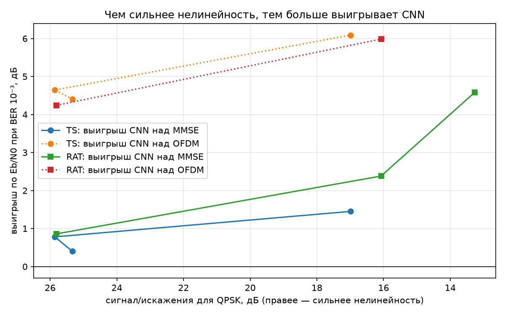

**Выводы:**
- **Выигрыш CNN растёт вместе с нелинейностью:** от −0.5 дБ на линейном канале (CNN чуть хуже лучшего линейного приёмника) до **+4.6 дБ на RAT 100**. Это главный результат работы в симуляции.
- **Жёсткое ограничение даёт CNN больше пространства, чем мягкое:** при близком SDR (~16–17 дБ) выигрыш на RAT 66 — 2.4 дБ, на TS 100 — 1.5 дБ.
- **OFDM проигрывает CNN 4–6 дБ даже на слабых искажениях,** а на RAT 100 вообще не достигает BER 10⁻³. Причина в таблице SDR: при той же средней мощности у OFDM искажения на 4–7 дБ сильнее, чем у QPSK, — у суммы поднесущих выше пики.
- **Гармоника синуса занижает реальную силу искажений:** TS 33 почти не трогает синус (−45 дБ), но у QPSK уже SDR 25 дБ, у OFDM — 18 дБ. Для сигналов связи нужно мерить SDR, а не гармоники.
- **Абсолютные значения между сценариями сравнивать нельзя:** у каждой ступени своя ИХ (у TS, например, свой «горб» АЧХ). ~4 дБ разницы между «без искажений» и TS 33 объясняются в основном ИХ: при SDR 25 дБ искажения почти не влияют на BER около 10⁻³. Выигрыш CNN над MMSE от этого не зависит — оба работают на одном и том же канале.
- На высоком SNR у CNN снова виден пол ~10⁻⁵…3·10⁻⁴ (TS 100, RAT 66, RAT 100) — см. Э18.
- Сценарий RAT 100 в серии обучен заново, поэтому `figures/cnn_RAT 100.png` и `models/RAT 100.pt` теперь от этого прогона; числа отличаются от таблицы Э18 в пределах ~10% (например, 12 дБ: 5.0·10⁻³ против 5.6·10⁻³).

---

## Дальше

- Учесть реальную громкость полосы (не нормировать канал), чтобы сравнивать несущие честно.
- Убрать пол CNN на высоком SNR: перевес высокого SNR в обучении или отдельные модели.
- Длинные хвосты: окно больше, DFE (эквалайзер с обратной связью по решениям) и её нейросетевой аналог.
- Отделить влияние ИХ от нелинейности: та же серия на одной общей ИХ.
- Обобщение: обучить на одном канале, проверить на другом; зависимость качества от размера датасета.
- Сильнее классику: эквалайзер с обратной связью по решениям (DFE) для длинных хвостов.
- Настоящие передачи через TS/RAT и колонки для проверки моделей на живых данных.
- Отдельно: JBL по Bluetooth (телефон → JBL) — канал со сжатием кодеком; ноутбук не замерялся.
