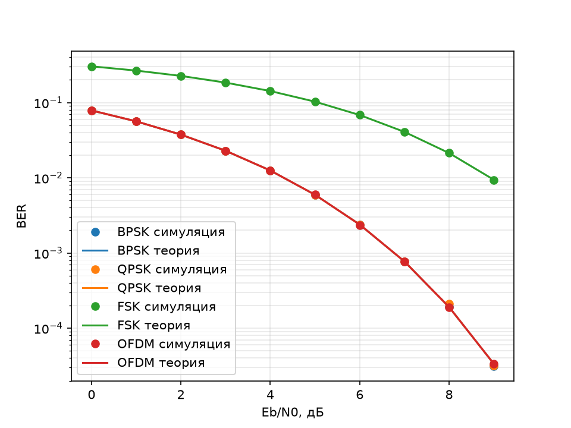
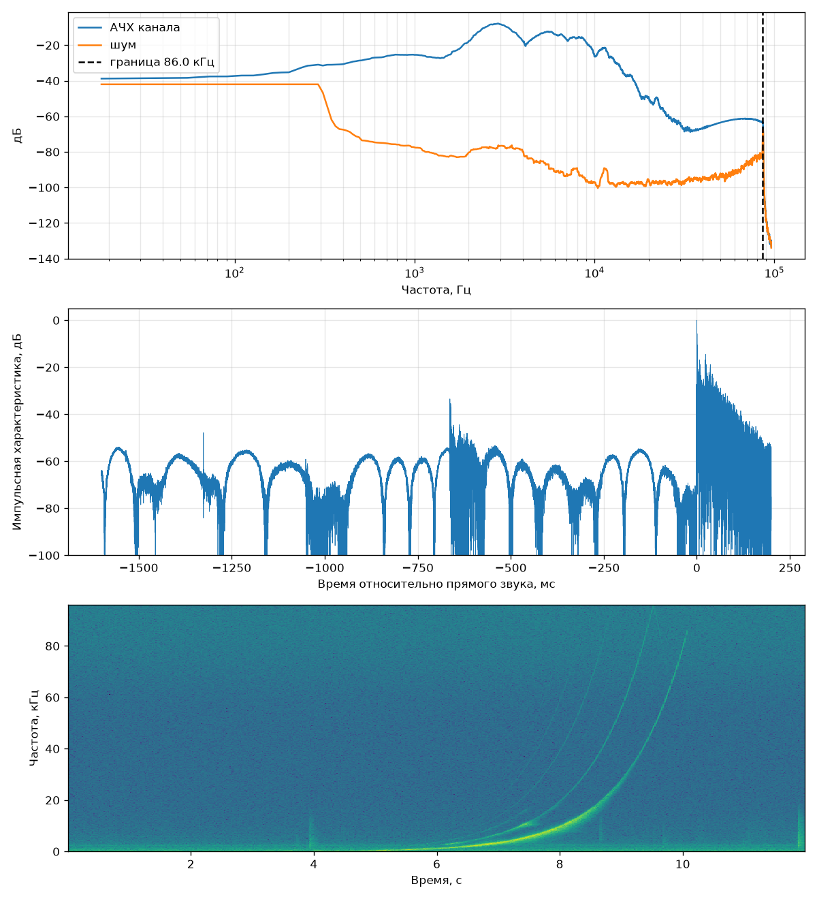
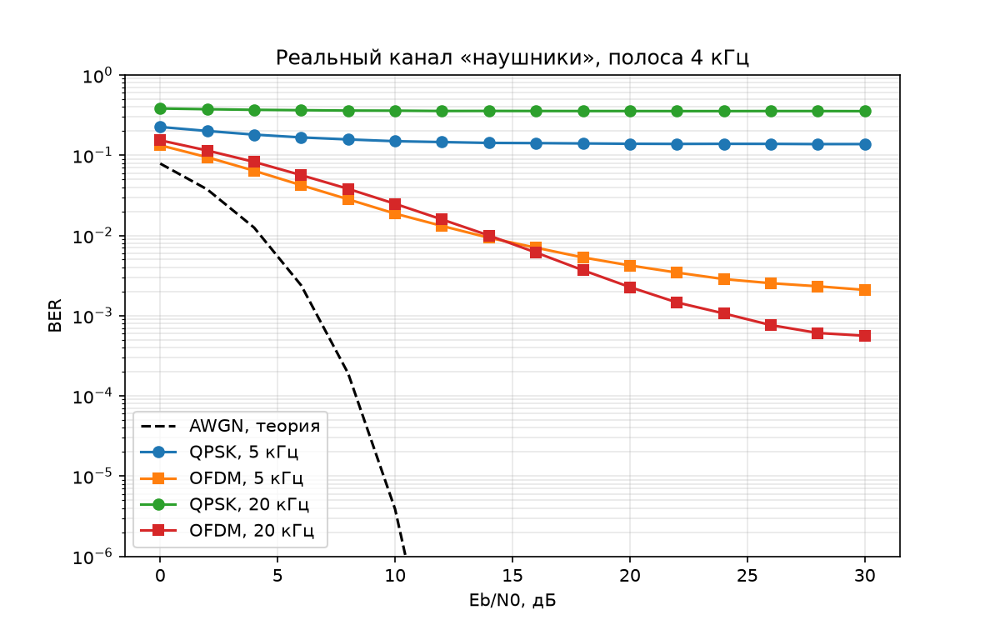

# Журнал экспериментов

## Установка

| Узел | Что | Настройки |
|---|---|---|
| Микрофон | Behringer B-1 (конденсаторный, кардиоида) | фантом 48V, фильтр **flat**, pad **выкл** |
| Звуковая карта | Arturia MiniFuse 2 | 192 кГц, вход 1 — микрофон |
| Излучатель | гитарные наушники | лежат у капсюля микрофона, громкость системы 100% |
| ПО | Python 3.14, numpy, scipy, sounddevice, PipeWire 1.6 | запись через устройство `pipewire` |

PipeWire по умолчанию работает на 48 кГц. Разрешённые частоты расширены в `~/.config/pipewire/pipewire.conf.d/10-rates.conf`, а `sweep.py` на время замера включает `clock.force-rate 192000` и потом возвращает его. Без этого PipeWire остаётся на 48 кГц, пока открыт браузер.

Команды:
```
.venv/bin/python simulator.py                  # все графики BER в figures/
nix-shell --run 'python sweep.py наушники'     # замер канала
.venv/bin/python sweep.py наушники --из-файла  # повторный анализ записанного
```

---

## Э1. Симулятор модуляций в AWGN-канале — 2026-09-24

**Цель:** проверить, что симулятор правильный, сравнив его с теоретическими кривыми BER.

**Метод:** BPSK, QPSK, некогерентная FSK, OFDM (1024 поднесущих, префикс 256), по 2 млн бит на точку, Eb/N0 от 0 до 9 дБ.



**Результат:** все точки легли на теорию. BPSK, QPSK и OFDM совпадают, FSK отстаёт примерно на 4 дБ (цена некогерентного приёма). Симулятор годится как эталон.

---

## Э2. Замер свипом, попытка 1 — неудачная

**Условия:** громкость системы 27%, фоновые звуки в комнате, метод «спектр свипа против спектра тишины».

**Результат:** граница «8.3 кГц» — **ложная**. Свип был едва громче фона (+5…10 дБ), а фон менялся со временем (речь, щелчки), поэтому оценка шума по первым 2 секундам не работает.

**Вывод:** нужны громкость, тишина и метод, устойчивый к меняющемуся шуму. График не сохранился, его перезаписала следующая попытка.

---

## Э3. Замер свипом, попытка 2 — перегруз

**Условия:** громкость 100%, наушник у микрофона, фильтр B-1 переключён в flat.

**Результат:** граница «96 кГц» — **ложная**. Пик записи 1.00 означает клиппинг на 2–5 кГц (там резонанс наушников), на спектрограмме видны гармоники 2×, 3× и алиасинг выше 96 кГц. Зато основная линия свипа была видна до 86 кГц: это первый признак, что ультразвук проходит.

**Вывод:** убавить гейн на MiniFuse; перейти на деконволюцию, которая отделяет гармоники от линейного отклика.

---

## Э4. Замер свипом с деконволюцией — канал «наушники»

**Метод:** экспоненциальный свип 20 Гц – 86 кГц, 8 с, −6 дБFS. Импульсная характеристика (ИХ) = запись, поделённая на спектр свипа (с регуляризацией). Для АЧХ берётся окно ИХ от −5 до +50 мс; для оценки шума — такое же окно на 0.5 с позже. Пик записи 0.35, перегруза нет.



**Результат:**
- **1–15 кГц** — основная полоса, резонансный горб на 2–8 кГц.
- **18–22 кГц** — на 35–45 дБ ниже пика, но с большим запасом над шумом.
- **30–86 кГц** — около −65 дБ, запас над шумом 20–30 дБ. **Ультразвук проходит**, граница совпадает с концом свипа (86 кГц), реальный потолок может быть выше.
- **ИХ:** прямой звук, затем хвост отражений ~200 мс (затухание от −20 до −55 дБ). Среднеквадратичный разброс задержек ~16 мс. Это многолучёвость комнаты — аналог подводного канала.
- Гармоники искажений видны на −660 мс (2-я) и −1330 мс (4-я), точно по теории для экспоненциального свипа. В АЧХ они не попали.

**Ограничения:** ниже ~300 Гц АЧХ размыта сглаживанием по 600 Гц. Ровные «купола» на −55…−65 дБ в ИХ — артефакт деконволюции, они слегка завышают оценку шума.

ИХ сохранена в `channels/наушники.npy` (250 мс, 192 кГц) и используется в симуляции.

---

## Э5. Модуляции на реальном канале комнаты

**Метод:** ИХ из Э4 переносится в комплексную baseband-форму на несущих 5 кГц и 20 кГц (полоса 4 кГц, энергия нормирована на 1). Классические приёмники:
- **QPSK** — компенсирует только фазу прямого луча, без эквалайзера;
- **OFDM** — 1024 поднесущих, префикс 256 (64 мс), эквалайзер по одному коэффициенту на поднесущую при известном канале.



**Результат:**

| | QPSK | OFDM |
|---|---|---|
| 5 кГц | пол ошибок ≈ 0.14 | ≈ 2·10⁻³ при 30 дБ |
| 20 кГц | пол ≈ 0.35 | ≈ 6·10⁻⁴ при 30 дБ |

**Почему так:**
- У QPSK отражения несут энергию, сравнимую с прямым лучом (−0.8 дБ на 5 кГц) или даже больше неё (+8.5 дБ на 20 кГц). Межсимвольная интерференция делает связь без эквалайзера невозможной.
- OFDM снимает всё, что укладывается в префикс, но энергия хвоста после 64 мс составляет −18 дБ. Это даёт пол ошибок около 10⁻³, и OFDM далеко отстаёт от кривой AWGN.
- Правильность проверена в `test_simulator.py`: на синтетическом канале OFDM совпадает с теорией частотно-избирательного канала (0.0400 против 0.0401).

**Вывод для работы:** между кривыми AWGN и реального канала лежит разрыв в десятки дБ. Именно на этом участке нейросетевой приёмник должен показать, может ли он переиграть классику: убрать пол ошибок QPSK и хвост после префикса у OFDM.

---

## Дальше

- Замеры остальных излучателей: ноутбук, телефон, JBL (Bluetooth), гитарный усилитель, ТВ.
- Классические эквалайзеры (LMS/RLS, MMSE) как честная базовая линия для CNN.
- CNN-приёмник на данных симуляции с реальными ИХ.
